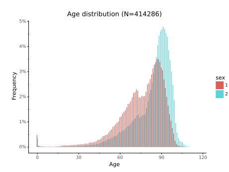

#  data source example: connecting to an open-data API

[](https://circleci.com/gh/hchauvin/opendata-example/tree/master) [](https://opensource.org/licenses/MIT) [](https://opensource.org/licenses/MIT) [](https://opensource.org/licenses/MIT)

This repo shows how Spark (3.0) can be leveraged to read open data accessible from remote APIs.

The death registry published by the French government is taken as an example. It
contains in total more than 30 million death events since 1970.



The retrieval is performed using the new data source SPI introduced in Spark 3.0.
The data source SPI for extracting data from remote APIs can give cleaner, more reusable
code than _ad hoc_ processing and is not necessarily more difficult to master.

## Usage in a notebook or in a script

[./tests/cluster-test.sc]() gives an example of how to use the data source.  This example
requires [sbt](https://www.scala-sbt.org/), [ammonite](https://ammonite.io/) and
[docker](https://www.docker.com/) to be installed locally.

The following instructions create a fat jar with all the code for the Spark data source,
spin off a Spark cluster using docker-compose and runs a Spark session in ammonite,
a scala REPL:
```bash
sbt assembly
./tests/cluster-test.sh
```

There is also an example [polynote](https://polynote.org/) notebook, [./tests/SparkTest.ipynb]().

## Development

Unit and integration tests:

```bash
sbt test
```

End-to-end tests:

```bash
sbt assembly
./tests/cluster-test.sh
```

Code formatting:

```
sbt scalafmtAll
```

## License

`opendata-example` is licensed under [The MIT License](./LICENSE).

[](https://app.fossa.com/projects/git%2Bgithub.com%2Fhchauvin%2Fopendata-example?ref=badge_large)
